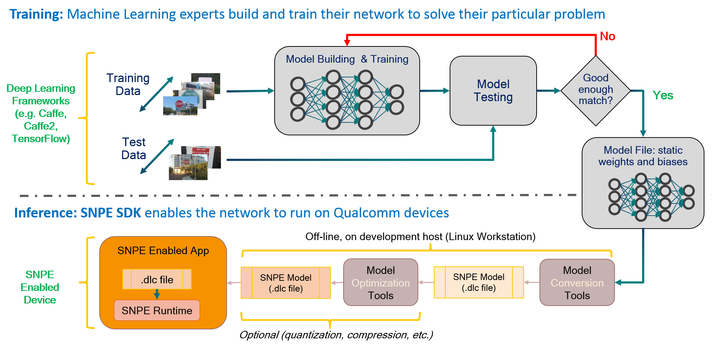
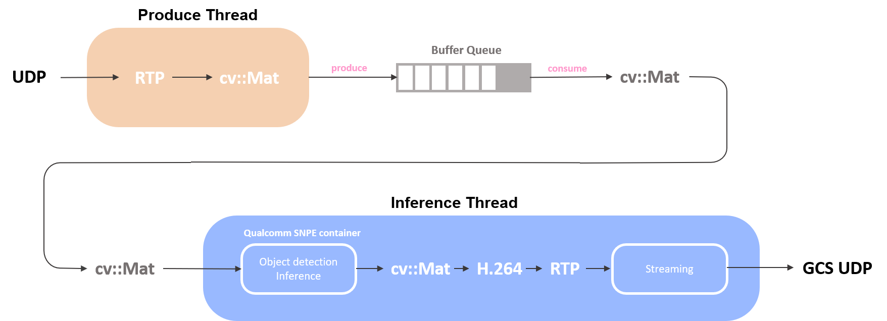

# Qualcomm SNPE Inference
A yolov7 tiny model inference applied qualcomm snpe for the pedestrian detection on the multirotor with gstreamer pipeline.

## 1. Overview
To minimize the inference time cost, we just reduce the input image size and detection classes. The yolov7 model is trained on the x86 PC first with 23 classes (include human, some animals and vehicles) from the coco dataset. And after evaluating the performance of the model, we first apply the `export.py` tool from the yolov7 to convert the PyTorch torch scripts `*.pt` into `onnx` format. Then, we could use [netron](https://netron.app/) to visualize the the architecture of the model, and decide where to trim the node (or check whether snpe supports). At last, we use the qualcomm snpe sdk tools to convert the `onnx` format into `*.dlc`, which is usable for the snpe container.

For realtime application on drone, we create a multi-threading processing pipeline, one receive the image from gstreamer caps and convert it into opencv format (`cv::Mat`) and push into a buffer queue we designed, the other one just pop the image out and inference the image and then transmit the processed image to the indicated ground station.

## 2. Quick Start
1. Setup Qualcomm `SNPE` software develop kit
2. Configure the GStreamer pipeline and model container path in [`config.json`](./cfg/config.json)
3. Build the project
    * `$ mkdir build && cd build`
    * `$ cmake ..`
    * `$ make`
4. Excute the project with `$ ./snpe_task`
5. Make sure the ground control station has already in process.
6. (optional) Run the `gst-client` as the ground control station to receive the processed image. 
    * `$ source client/gst-client.sh`

## 3. References
* [yolov7 / yolov7-tiny](https://github.com/WongKinYiu/yolov7)
* [qualcomm snapdragon neural processing engine](https://developer.qualcomm.com/sites/default/files/docs/snpe/overview.html)